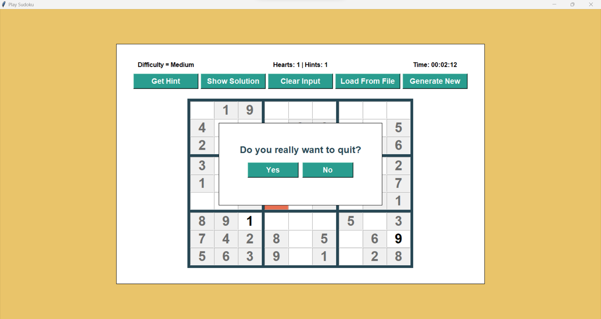
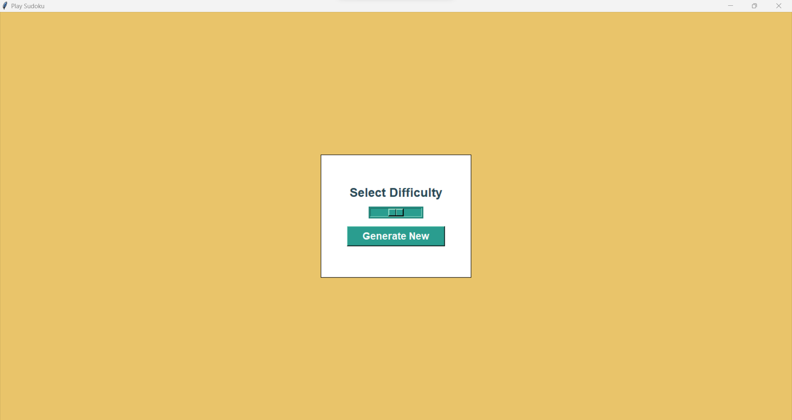

# Sudoku Game Documentation

This document provides an overview and explanation of the code for a Sudoku puzzle game implementation using the **tkinter library** in Python.

## Table of Contents

1. **Basics**
   - `tkinter`: A library for creating User Interfaces in Python. This project contains one implementation using old tkinter widgets and another one using the newer ttk widgets.
   - `py-sudoku`: A library for generating and solving Sudoku puzzles. Sadly it does not check whether the generated Sudoku puzzle has only a single solution.
   - `Single Solution Check`: A custom implementation to check that generated Sudoku puzzles have only a single solution, if not keeps generating until it finds one. Also checks when loading a Sudoku puzzle from a file if it has only a single or multiple solutions. Displays a print message containing this information.
2. **Features**
   - `Generate New`: Generate a new Sudoku puzzle with 5 different difficulty levels.
   - `Load From File`: Load a Sudoku puzzle from a **.txt** file.
   - `Get Hint`: Users can ask for a hint, if they get stuck. The hint is the correct value for one of the empty cells.
   - `Show Solution`: Users can entirely give up and ask for a solution to the whole Sudoku puzzle.
   - `Clear Input`: Users can clear all the input and start over again.
   - `Timer`: A timer keeps track of how much time the user has spent on a Sudoku puzzle.
   - `Lives/Hints counter`: Keep track of how many lives/hints are still remaining. Default is 3 lives and 3 hints.
   - `Instant Feedback`: Checks whether the entered number in an empty field is correct. Any wrong value is displayed in a red background and the player loses one life.
3. **Possible Improvements**
   - `Single Solution Check Speed`: The time for checking if a Sudoku puzzle has only a single solution starts to increase drastically when trying to create puzzles with less than 30 fields given.
   - `Difficulty`: Different difficulty levels only take the amount of given fields in consideration. Other interesting considerations would be for example how often each number appears, how many numbers are given per square, more thought about the general distribution of the given numbers to increase/decrease difficulty and many more...
   - `Different UI Color Scheme`: Just went with a color set I liked but would be interesting to see what other people can come up with.
4. **Snapshots**

