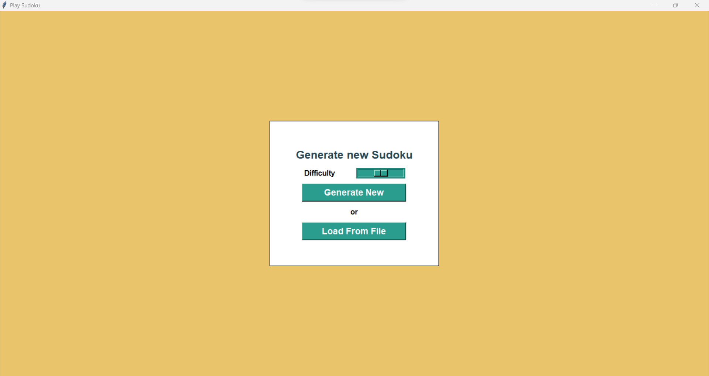
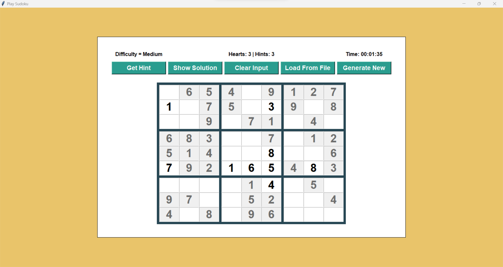
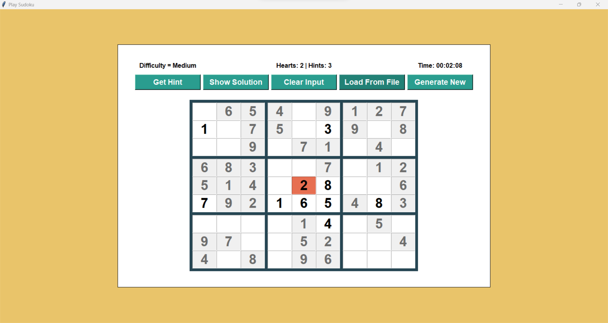
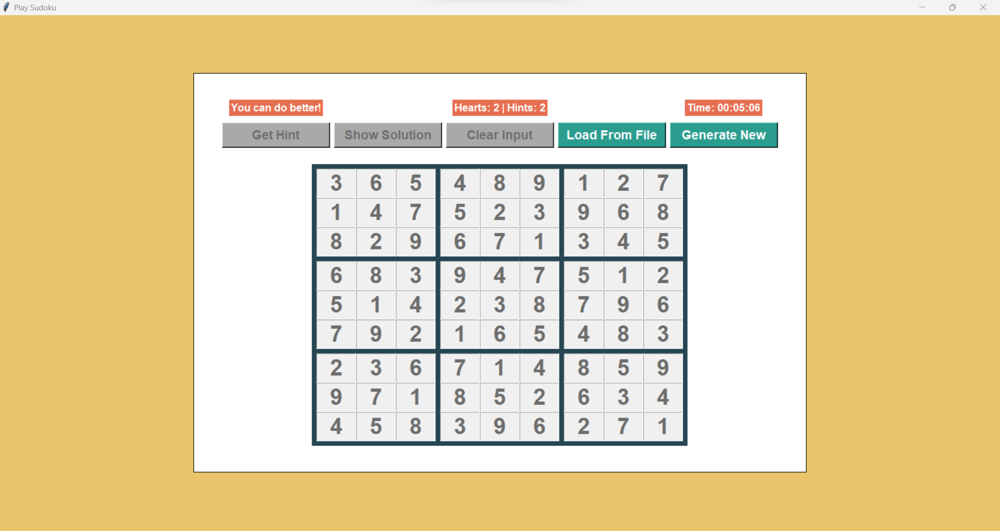
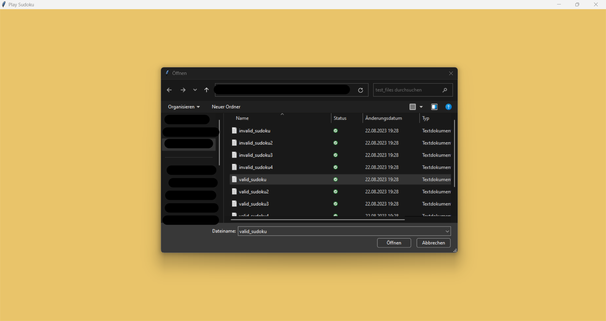
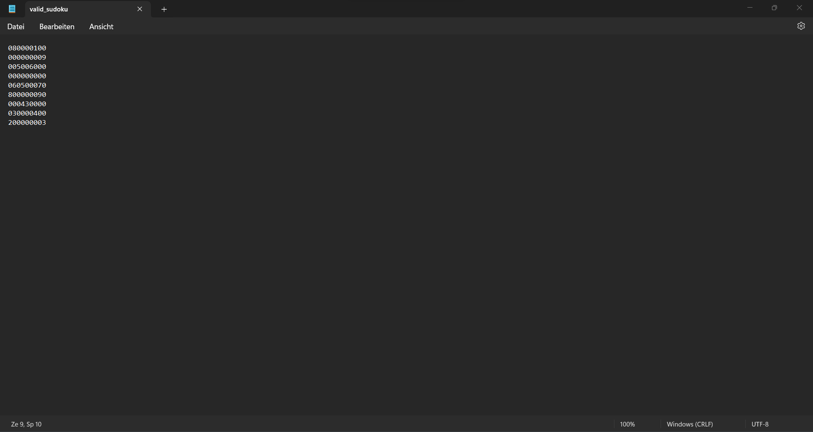
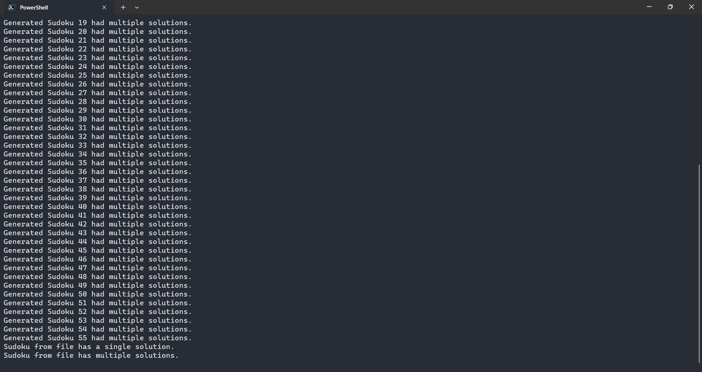

# Sudoku Game Documentation

This document provides an overview and explanation of the code for a Sudoku puzzle game implementation using the **tkinter library** in Python.

## How to run

### Install Dependencies

Before running the project, install the required dependencies using pip:

``` bash
# tk is only required if you are not using Python 3.7 or higher
pip install tk
pip install py-sudoku
```

### Choose User Interface

This Sudoku puzzle game provides two user interfaces - one with traditional tkinter widgets and another with newer ttk widgets.

#### Traditional widgets

``` bash
python tk_sudoku.py
```

#### Modern widgets

``` bash
python ttk_sudoku.py
```

## Content

### General Information

- `tkinter`: A library for creating User Interfaces in Python. This project contains one implementation using old tkinter widgets and another one using the newer ttk widgets.

- `py-sudoku`: A library for generating and solving Sudoku puzzles. Sadly it does not check whether the generated Sudoku puzzle has only a single solution.

- `Single Solution Check`: A custom implementation to check that generated Sudoku puzzles have only a single solution. If a Sudoku puzzle has multiple solutions the program generates a new one until it finds one with a single solution. Also checks when loading a Sudoku puzzle from a file if it has only a single or multiple solutions. Displays a print message containing this information.

### Features

- `Generate New`: Generate a new Sudoku puzzle with 5 different difficulty levels.

- `Load From File`: Load a Sudoku puzzle from a **.txt** file with exactly 9 lines, each containing exactly 9 chars [0-9]. 0 represents an empty field.

- `Get Hint`: Users can ask for a hint, if they get stuck. The hint is the correct value for one of the empty cells.

- `Show Solution`: Users can entirely give up and ask for a solution to the whole Sudoku puzzle.

- `Clear Input`: Users can clear all the input and start over again.

- `Timer`: A timer keeps track of how much time the user has spent on a Sudoku puzzle.

- `Lives/Hints counter`: Keep track of how many lives/hints are still remaining. Default is 3 lives and 3 hints.

- `Instant Feedback`: Checks whether the entered number in an empty field is correct. Any wrong value is displayed in a red background and the player loses one life.

### Possible Improvements

- `Single Solution Check Speed`: The time for checking if a Sudoku puzzle has only a single solution starts to increase drastically when trying to create puzzles with less than 30 given fields.

- `Difficulty`: Different difficulty levels only take the amount of given fields in consideration. Other interesting considerations would be for example how often each number appears, how many numbers are given per square, more thought about the general distribution of the given numbers to increase/decrease difficulty and many more...

- `Different UI Color Scheme`: Just went with a color set I liked but would be interesting to see what other people can come up with.

## Snapshots

Here are some snapshots of the Sudoku puzzle game to give you a glimpse of the user interface and gameplay:

### Main Menu Screen


> Welcome to the Sudoku puzzle game! Choose your options and dive into the challenge.

### Gameplay Screen


> Here's the game in action. Solve the puzzle by entering numbers into the grid.

### Instant Feedback


> Receive instant feedback on your entries. Incorrect numbers are highlighted in red.

### Hint and Solution


> Get hints for individual cells or reveal the entire solution if needed.

### Load From File


> Load a custom made sudoku from a file. This also helps when struggling with a Sudoku puzzle in a newspaper.

### File Format Example


> Create a .txt file with exactly 9 lines. Each line needs to have exactly 9 numbers ranging from 0-9. 0 indicates an empty field.

### Single Solution Check


> Showing information about the puzzle generation process. Works also for puzzles loaded from files.

These snapshots provide a sneak peek into the various features and aspects of the Sudoku puzzle game. **Try it out yourself for the complete experience!**
